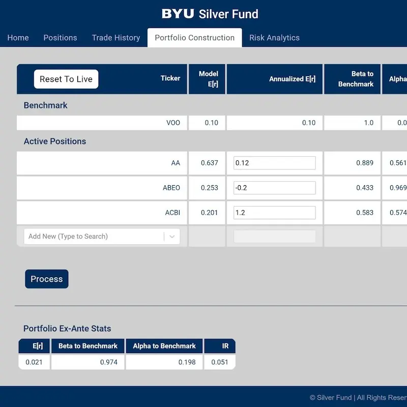

# Silver Fund Web App - A stocks/trades performance tracker/predictor site

This was the main project I worked on as a Software Engineer for Silver Fund (BYU's MBA Finance Program) during the second half of 2020.

I did full stack development on this project, handling both the front and back end. We used ReactJS on the front-end and Django (a Python web development framework) on the back-end. This website was originally active but has since been deprecated, but with the permission of Silver Fund I was able to recreate the front-end to showcase as part of my portfolio.

_Keep in mind that while at one point the app was fully integrated with a backend as far as authentication and stock/trades permament storage, it now just doesn't have authentication so anyone can view the website, and stocks/trades seen on the panes have been hard-coded._

### Web App Screenshots

### Visitors Page Screenshots

